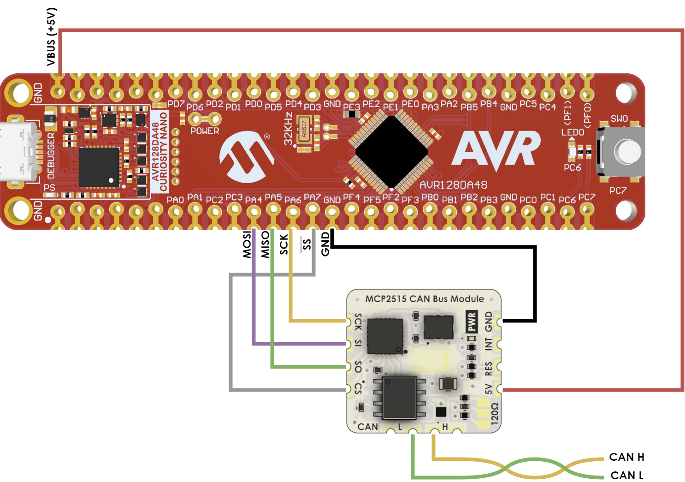

## Introduction

## Example usage
This example show how the library can be used with an AVR128DA48 Curiosity Nano board and the Castellated Dreams
Micro MCP2515 CAN bus Castellated Module

### Wiring
The Curiosity Nano and the Micro MCP2515 CAN bus Module can be wired as follows.

### AVR-MCP2515-CANBUS library methods

explane these later
- can.begin(CAN_BITRATE_t bitrate)
- can.available()
- can.sendMessage(&message)
- can.readMessage()

### Code examples

See the folowing code examples for how to use the library

Sending can bus messages: 
[examples/AVR128DA48-canbus-write/AVR128DA48-canbus-write/main.cpp](examples/AVR128DA48-canbus-write/AVR128DA48-canbus-write/main.cpp)

Reading can bus messages:
[examples/AVR128DA48-canbus-write/AVR128DA48-canbus-write/main.cpp](examples/AVR128DA48-canbus-write/AVR128DA48-canbus-write/main.cpp)
